# OWASP Juice Shop — Attack Surface Mapping & Security Assessment

> **Week 1 Task — Attack Surface Mapping**
> Reconnaissance, enumeration, and security assessment of a deliberately vulnerable OWASP Juice Shop instance, performed from a Kali Linux client.


---

## Table of Contents

- [Task Overview](#task-overview)
- [Scope](#scope)
- [Objectives](#objectives)
- [Methodology](#methodology)
- [Findings](#findings)
  - [1. Network Enumeration](#1-network-enumeration)
  - [2. Web Technology Fingerprinting](#2-web-technology-fingerprinting)
  - [3. Robots.txt Analysis](#3-robotstxt-analysis)
  - [4. Directory Enumeration & Listing Disclosure](#4-directory-enumeration--listing-disclosure)
  - [5. Exposed Confidential Documents](#5-exposed-confidential-documents)
  - [6. File Extension Filtering & Path Disclosure](#6-file-extension-filtering--path-disclosure)
  - [7. Product Search API](#7-product-search-api)
  - [8. Challenge API Enumeration](#8-challenge-api-enumeration)
  - [9. Client-Side Resource Analysis](#9-client-side-resource-analysis)
- [Confirmed Findings Summary](#confirmed-findings-summary)
- [Risk Assessment](#risk-assessment)
- [Recommendations](#recommendations)
- [Limitations](#limitations)
- [Conclusion](#conclusion)

---

## Task Overview

This assignment required deploying a personal instance of **OWASP Juice Shop** (an intentionally vulnerable web application) and performing unguided reconnaissance to build a structured **attack-surface map** — without a predefined endpoint list or attack path.

The assessment had to cover, at minimum:

- **Web application discovery** — public pages, routes, admin functionality, hidden paths
- **API discovery** — endpoints, HTTP methods, auth requirements
- **Technology fingerprinting** — frontend/backend stack, web server, JS libraries
- **Client-side analysis** — bundled scripts for leaked routes/config

Deliverables: a full written report, an attack-surface inventory table, an attack-surface diagram, a prioritized testing plan, and supporting evidence (this repo contains the evidence/report portion).

---

## Scope

| Item             | Value                              |
|------------------|-------------------------------------|
| Target IP        | `192.168.52.1`                     |
| Target Port      | `3000/TCP`                         |
| Application      | OWASP Juice Shop                   |
| Base URL         | `http://192.168.52.1:3000`         |
| Client           | Kali Linux                         |
| Assessment Type  | Authorized laboratory assessment   |

## Objectives

1. Identify exposed network services
2. Identify the web application and technology stack
3. Enumerate accessible web directories and files
4. Identify sensitive or improperly exposed resources
5. Investigate application endpoints
6. Test whether discovered resources could be accessed without authorization
7. Document successful vulnerabilities with supporting evidence
8. Identify additional attack surface for potential further testing

## Methodology

| Phase | Activity |
|-------|----------|
| 1 | Network enumeration (Nmap) |
| 2 | Web technology identification (WhatWeb) |
| 3 | Web directory enumeration (Gobuster) |
| 4 | `robots.txt` analysis |
| 5 | FTP/web file enumeration |
| 6 | File content analysis |
| 7 | Application API enumeration |
| 8 | Challenge validation via Juice Shop's own Challenge API |

---

## Findings

### 1. Network Enumeration

An Nmap service scan against the target confirmed TCP port `3000` open, running the Juice Shop web application.

```bash
nmap -sV -p 3000 192.168.52.1
```

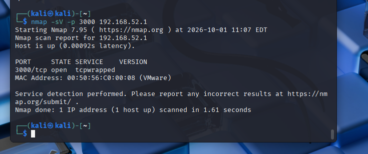

---

### 2. Web Technology Fingerprinting

WhatWeb confirmed the application as **OWASP Juice Shop**, an HTML5/JavaScript SPA, and surfaced several response headers of interest — notably a wide-open `Access-Control-Allow-Origin: *`.

```bash
whatweb http://192.168.52.1:3000
```

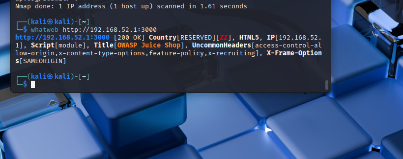

---

### 3. Robots.txt Analysis

```bash
curl -i http://192.168.52.1:3000/robots.txt
```

```
User-agent: *
Disallow: /ftp
```

`robots.txt` disclosed a hidden `/ftp` path — itself a form of information disclosure, since the directive only requests that crawlers stay away; it enforces no actual access control.

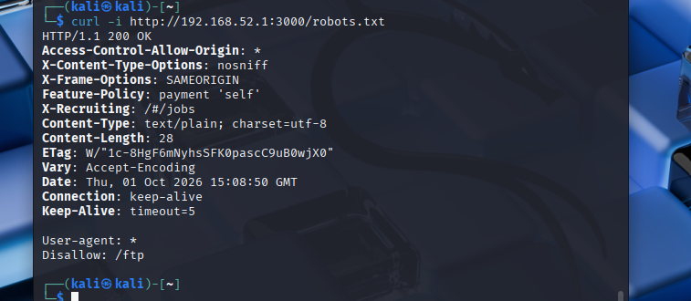

---

### 4. Directory Enumeration & Listing Disclosure

Gobuster enumeration (`/usr/share/wordlists/dirb/common.txt`) confirmed `/ftp` was directly reachable (`200 OK`), and directory indexing was enabled, returning a full file listing:

```bash
curl -s http://192.168.52.1:3000/ftp/ | grep -oE 'href="[^"]+"' | sed 's/href="//;s/"$//' | sort -u
```

```
acquisitions.md
announcement_encrypted.md
coupons_2013.md.bak
eastere.gg
encrypt.pyc
incident-support.kdbx
legal.md
package.json.bak
package-lock.json.bak
quarantine
suspicious_errors.yml
```

This is the **confirmed `directoryListingChallenge`** — unauthenticated directory indexing exposing internal filenames, including a KeePass credential database (`incident-support.kdbx`), backup files, and a compiled Python artifact.

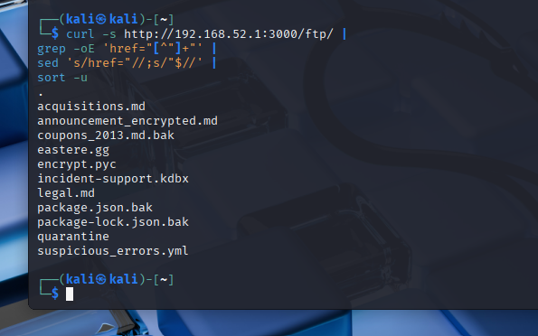

---

### 5. Exposed Confidential Documents

Two Markdown documents were directly retrievable with no authentication:

```bash
curl -s http://192.168.52.1:3000/ftp/acquisitions.md
curl -s http://192.168.52.1:3000/ftp/legal.md
```

`acquisitions.md` explicitly labels itself **"confidential! Do not distribute!"**, yet is served over an unauthenticated public path.

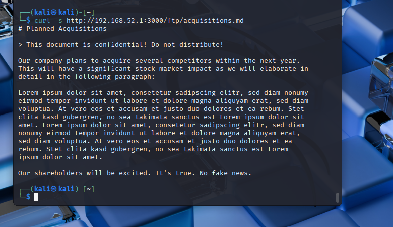
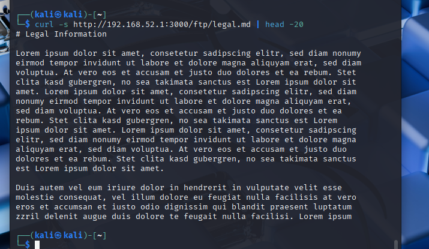

---

### 6. File Extension Filtering & Path Disclosure

Attempting to retrieve a non-Markdown/PDF file was blocked server-side:

```bash
curl -s -i http://192.168.52.1:3000/ftp/suspicious_errors.yml
```

```
403 Error: Only .md and .pdf files are allowed!
```

The error response also leaked an internal server-side source path:

```
/juice-shop/build/routes/fileServer.js:68:18
```

This is a secondary information-disclosure issue — verbose error handling exposing internal file structure.

---

### 7. Product Search API

The product search REST endpoint accepted arbitrary user-controlled query parameters and returned structured JSON:

```bash
curl -i "http://192.168.52.1:3000/rest/products/search?q=banana"
```

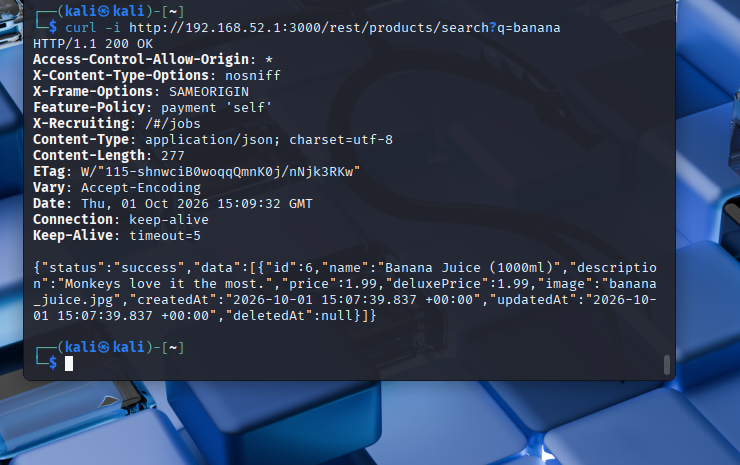

This endpoint is a strong candidate for injection testing (the application's own Challenge API lists `dbSchemaChallenge` and `unionSqlInjectionChallenge` against search-related functionality).

---

### 8. Challenge API Enumeration

Juice Shop exposes its own internal Challenge API, which was queried to map the full scope of the application's built-in attack surface (116 total challenges) and to validate which had actually been solved:

```bash
curl -s http://192.168.52.1:3000/api/Challenges
curl -s "http://192.168.52.1:3000/api/Challenges" | python3 -m json.tool | head -80
```

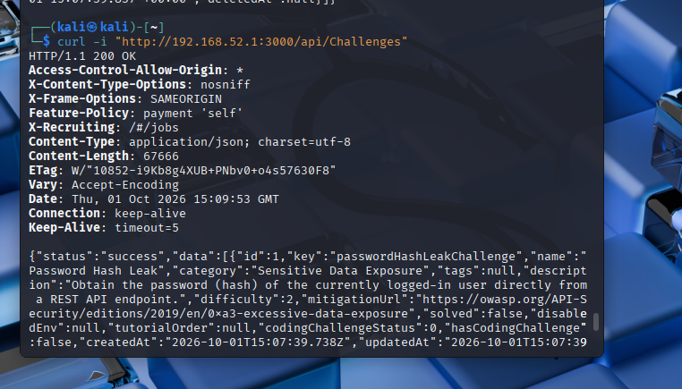
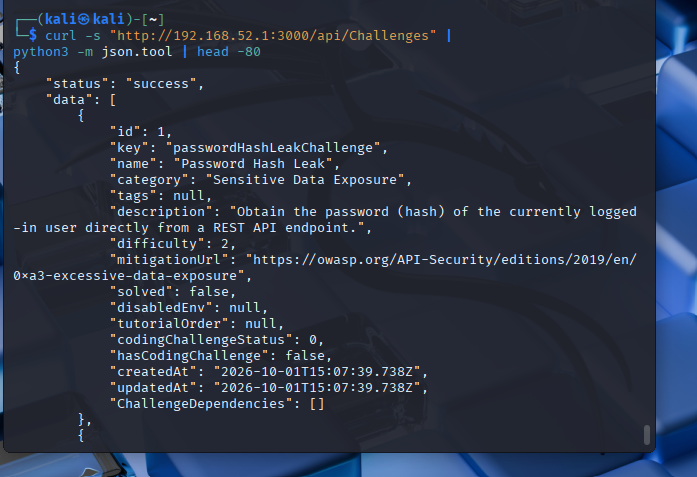
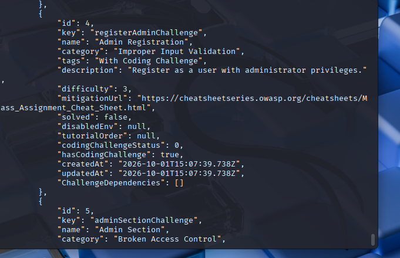

At the time of testing, the only challenge confirmed as `"solved": true` was `directoryListingChallenge`. Other high-value challenges identified (but not exploited/confirmed) include:

| Challenge | Security Area |
|---|---|
| `accessLogDisclosureChallenge` | Log disclosure |
| `fileWriteChallenge` | Arbitrary file modification |
| `dbSchemaChallenge` | SQL injection |
| `forgottenDevBackupChallenge` / `forgottenBackupChallenge` | Backup exposure |
| `dlpPastebinDataLeakChallenge` | Data leakage |
| `retrieveBlueprintChallenge` | Sensitive file exposure |
| `ssrfChallenge` | Server-side request forgery |
| `unionSqlInjectionChallenge` | SQL injection |
| `xxeFileDisclosureChallenge` | XXE / file disclosure |
| `exposedMetricsChallenge` | Metrics exposure |
| `misplacedIacFiles` | IaC/config exposure |
| `exposedCredentialsChallenge` / `leakedApiKeyChallenge` / `iacLeakedKeyChallenge` | Credential / secret exposure |
| `vulnerableDockerImageChallenge` | Container security |
| `registerAdminChallenge` | Mass assignment / broken access control |

---

### 9. Client-Side Resource Analysis

The application's root HTML was inspected for loaded JS bundles:

```bash
curl -s http://192.168.52.1:3000/ | grep -oE 'src="[^"]+\.js[^"]*"'
```

```
src="polyfills.js"
src="scripts.js"
src="main.js"
```

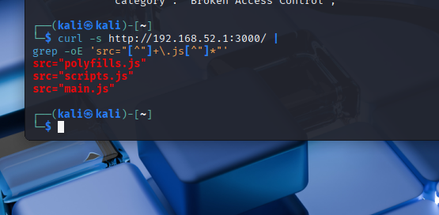

These Angular-compiled bundles are the natural next step for deeper client-side analysis (route tables, embedded API paths, and configuration strings are typically recoverable from `main.js`).

---

## Confirmed Findings Summary

| ID | Finding | Evidence | Status |
|----|---------|----------|--------|
| F-01 | Directory listing exposed on `/ftp/` | Directory index returned file listing | **Confirmed** |
| F-02 | Confidential document publicly accessible | `acquisitions.md` retrievable, self-labeled confidential | **Confirmed** |
| F-03 | Internal/backup files exposed via listing | `.bak`, `.pyc`, `.kdbx`, `.yml` files visible | **Confirmed** |
| F-04 | Internal server source path disclosure | `fileServer.js:68:18` returned in 403 error | **Confirmed** |
| F-05 | Public document access without auth | `legal.md` directly retrievable | **Confirmed** |
| F-06 | Encrypted document publicly accessible | `announcement_encrypted.md` retrievable | **Confirmed** |
| F-07 | Product search API accessible, unauthenticated | `/rest/products/search?q=banana` returned data | **Confirmed** |
| F-08 | Broad additional attack surface identified | Challenge API (116 challenges) | Identified, not exploited |

---

## Risk Assessment

The exposure of the `/ftp/` directory is the assessment's most significant confirmed issue. In combination, directory indexing, publicly reachable confidential-looking documents, backup artifacts, a credential-database-named file (`incident-support.kdbx`), encrypted material, and internal source-path disclosure create a meaningful **information-disclosure risk**.

No claim is made that every exposed file's contents were verified or that every listed Challenge-API item was successfully exploited — findings are scoped strictly to what was directly confirmed during testing.

---

## Recommendations

1. **Disable directory indexing** on production web servers.
2. **Remove sensitive files** (`*.bak`, `*.kdbx`, `*.pyc`, `*.yml`, `*.json`) from web-accessible directories.
3. **Implement real authorization** for confidential documents — never rely on `robots.txt` as an access control.
4. **Strip backup/dev artifacts** (`*.bak`, `*.old`, `*.tmp`) before deployment.
5. **Return generic error messages**; keep stack traces and internal paths in server-side logs only.
6. **Review CORS configuration** — restrict `Access-Control-Allow-Origin` to trusted origins where sensitive functionality is involved.
7. **Secure credential/secret artifacts** (e.g. `.kdbx` files) using a proper secrets-management system, not the web root.

---

## Limitations

- Performed against an intentionally vulnerable lab instance, not a production system.
- Not all 116 Juice Shop challenges were tested or exploited.
- The Challenge API identifies potential attack surface; presence alone does not equal successful exploitation.
- Contents of some exposed files (e.g. the encrypted announcement, the KeePass database) were identified but not fully analyzed/decrypted.
- SQL injection–related challenges were identified but not documented as successfully exploited in this phase.
- No claim is made that the application is free of additional vulnerabilities beyond what is documented here.

---

## Conclusion

This assessment demonstrated how a structured, unguided reconnaissance methodology — network scanning, technology fingerprinting, `robots.txt` review, directory enumeration, and API discovery — can expose significant application attack surface with minimal tooling. The clearest confirmed issue was **directory listing and information disclosure via `/ftp/`**, corroborated by Juice Shop's own Challenge API (`directoryListingChallenge: solved`). Numerous additional attack-surface items (SQLi-prone search endpoints, SSRF, XXE, credential exposure, IaC leaks) were mapped via the Challenge API for prioritization in a subsequent, deeper penetration test.

---

### Reproduction Commands

```bash
# Service identification
nmap -sV -p 3000 192.168.52.1

# Technology fingerprinting
whatweb http://192.168.52.1:3000

# robots.txt
curl -i http://192.168.52.1:3000/robots.txt

# Directory enumeration
gobuster dir -u http://192.168.52.1:3000 -w /usr/share/wordlists/dirb/common.txt

# FTP directory listing
curl -s http://192.168.52.1:3000/ftp/ | grep -oE 'href="[^"]+"' | sed 's/href="//;s/"$//' | sort -u

# Retrieve exposed documents
curl -s http://192.168.52.1:3000/ftp/acquisitions.md
curl -s http://192.168.52.1:3000/ftp/legal.md

# Extension-restriction / error disclosure
curl -s -i http://192.168.52.1:3000/ftp/suspicious_errors.yml

# Product search API
curl -i "http://192.168.52.1:3000/rest/products/search?q=banana"

# Challenge API
curl -s http://192.168.52.1:3000/api/Challenges | python3 -m json.tool

# Client-side JS bundles
curl -s http://192.168.52.1:3000/ | grep -oE 'src="[^"]+\.js[^"]*"'
```

---

**Target:** OWASP Juice Shop · **IP:** `192.168.52.1` · **Port:** `3000/TCP`
**Confirmed challenge:** `directoryListingChallenge`
**Assessment status:** Complete
